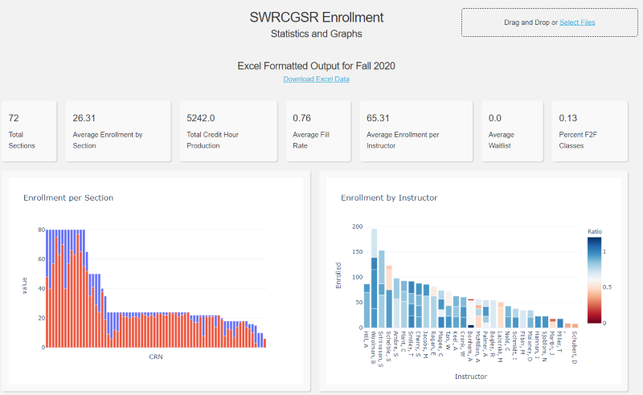

# academia-admin-automation
 Miscellaneous scripts to automate administrative tasks in academia.

    [](https://www.codefactor.io/repository/github/paradoxdruid/academia-admin-automation) [](https://github.com/ambv/black) 


## Current Scripts

1. [enrollment_dashboard.py](#enrollment_dashboardpy)
2. [process_enrollment.py](#process_enrollmentpy)
3. [retrieve_enrollment.py](#retrieve_enrollmentpy) 

### enrollment_dashboard.py



`enrollment_dashboard.py` is a [Dash](https://plotly.com/dash/) webapp to allow user submission of SWRCGSR data, providing a report of summary statistics and graphs as output.

The webapp is live at [https://enroll.bonhamcode.com](https://enroll.bonhamcode.com).

### process_enrollment.py

`process_enrollment.py` is a CLI to process pre-downloaded output of Banner systems enrollment reports (**SWRCGSR**) into editable .xlsx files.

**Usage**

```
process_enrollment.py Name_Of_Downloaded_SWRCGSR_File.txt
```

### retrieve_enrollment.py

`retrieve_enrollment.py` implements a [Selenium](https://pypi.org/project/selenium/)-based approach to automatically log into Banner 9 systems, download an enrollment report (**SWRCGSR**), and re-format it into an editable .xlsx file.

**Usage**

```
retrieve_enrollment.py --excel
```
Note: prior to use, `private.py` must be edited to have the user's Banner username and password, as well as the filesystem location of the selenium chromedriver.  `info.txt` must be edited to specify the terms, department codes, and other parameters for the retrieval.


## Authors
These scripts are developed as academic software by [Dr. Andrew J. Bonham](https://github.com/Paradoxdruid) at the [Metropolitan State University of Denver](https://www.msudenver.edu). `retrieve_enrollment` was substantially developed in collaboration with [Dr. Henc Bouwmeester](https://github.com/HencBouwmeester).  It is licensed under the GPL v3.0.
